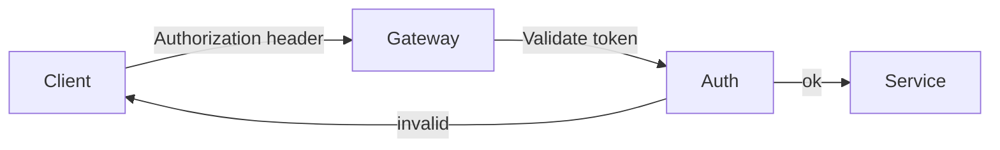

# Studio Protocol {#studio-protocol}

The Studio Protocol defines interoperable behavior for authoring and rendering technical specs.
A <dfn>session token</dfn> binds an authenticated request to a client instance.
See [\u00a7#requirements|requirements] for the normative rules.

## Conventions {#conventions}

The key words **MUST**, **SHOULD**, and **MAY** are interpreted as described in [[!RFC2119]] and [[!RFC8174]].

The [=session token=] is carried in an `Authorization` header. Implementations may expose {{Request}}
metadata and [^button^] element semantics in the authoring UI.

## Requirements {#requirements}

<section data-cop="client">
  <spec-statement id="client-auth">A client MUST send credentials before calling protected endpoints.</spec-statement>
  <spec-statement>A client SHOULD refresh an expired session token before retrying.</spec-statement>
</section>

<aside class="note warning" id="token-warning">
  
Tokens SHOULD be short-lived and rotated regularly to reduce replay risk.

</aside>

<aside class="example" id="example-auth">
  
<strong>Example:</strong> Authorization: Bearer eyJhbGciOi...

</aside>

### Error handling {#errors}

If authorization fails, the server returns `401` with a JSON error object.
See [\u00a7#data-model|the data model] for payload fields.

### Data model {#data-model}

| Field | Type | Description |
| ----- | ---- | ----------- |
| `code` | `string` | Stable error code for client logic |
| `message` | `string` | Human-readable explanation |
| `retryAfter` | `number` | Optional backoff hint in seconds |

## References {#references}

Additional context appears in [[HTML]].
