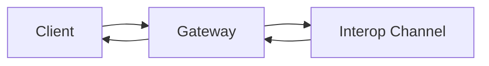

# Profiles Catalog {#profiles-catalog}

:::include ./partials/summary.md :::

## Compatibility Matrix {#compatibility-matrix}

| Profile | Transport | Required term |
| :------ | :-------- | :------------ |
| Core | HTTP | [=session token=] |
| Interop | WS | [=interop channel=] |

## Normative Links {#normative-links}

Implementers should consult [§#runtime-overview|runtime overview] and the IDL symbol {{InteropChannel}}.

## Message Flow Diagram {#message-flow-diagram}

