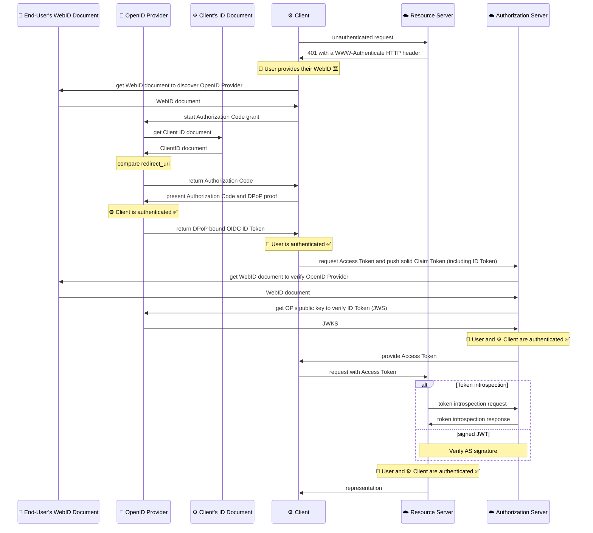
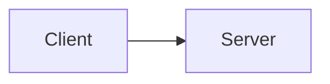
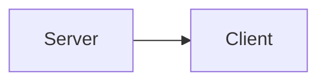

## Abstract {data-no-toc}

The Solid OpenID Connect (Solid-OIDC) specification defines how resource servers verify the identity of relying parties and end users based on the authentication performed by an OpenID provider. Solid-OIDC builds on top of OpenID Connect to provide decentralized authentication without the need to mutually register the relying party and the identity provider.

## Status of this document {data-no-toc}

This report was published by the [Solid Community Group](https://www.w3.org/community/solid/). It is not a W3C Standard nor is it on the W3C Standards Track. Please note that under the [W3C Community Contributor License Agreement (CLA)](https://www.w3.org/community/about/cla/) there is a limited opt-out and other conditions apply. Learn more about [W3C Community and Business Groups](https://www.w3.org/community/).

## Introduction {#intro}

_This section is non-normative_

The [Solid project](https://solidproject.org/) aims to change the way web applications work today to
improve privacy and user control of personal data by utilizing current standards, protocols, and
tools, to facilitate building extensible and modular decentralized applications based on
[Linked Data](https://www.w3.org/standards/semanticweb/data) principles.

This specification is written for Authorization and Resource Server owners intending to implement
Solid-OIDC. It is also useful to Solid application developers charged with implementing a Solid-OIDC
client.

The OAuth 2.0 [[!RFC6749]] and OpenID Connect Core 1.0 [[!OIDC-CORE]] web standards were
published in October 2012 and November 2014, respectively. Since publication they've seen rapid and
widespread adoption across the industry, in turn gaining extensive _"real-world"_ data and
experience. The strengths of the protocols are now clear; however, in a changing eco-system where
privacy and control of digital identities are becoming more pressing concerns, it is also clear
that additional functionality is required.

The additional functionality documented herein aims to address:

1. Resource servers and their Authorization servers having no existing trust relationship with identity providers.
2. Ephemeral Clients as a first-order use-case.

### Out of Scope {#intro-out-of-scope}

_This section is non-normative_

While the Solid-OIDC specification describes the structure of an ID Token for use in Solid, the definition of a global access token for use with Solid Resource Servers is beyond the scope of this specification.

## Terminology {#terms}

_This section is non-normative_

This specification uses the terms "access token", "authorization server", "resource server" (RS), "token endpoint",
"grant type", and "client" as defined by The OAuth 2.0 Authorization Framework [[!RFC6749]].

Throughout this specification, we will use the term OpenID Provider (OP) in line with the
terminology used in the Open ID Connect Core 1.0 specification (OIDC) [[!OIDC-CORE]].
It should be noted that this is distinct from the entity referred to as an Authorization Server
by the OAuth 2.0 Authorization Framework (OAuth) [[!RFC6749]].

This specification also uses the following terms:

<dl>
<dt>*WebID* as defined by [[!WEBID]]</dt>
<dd>
    A WebID is a URI with an HTTP or HTTPS scheme which denotes an Agent (Person, Organization, Group,
    Device, etc.).
</dd>

<dt>*JSON Web Token (JWT)* as defined by [[!RFC7519]]</dt>
<dd>
    A string representing a set of claims as a JSON object that is encoded in a JWS or JWE, enabling the
    claims to be digitally signed or MACed and/or encrypted.
</dd>

<dt>*JSON Web Key (JWK)* as defined by [[!RFC7517]]</dt>
<dd>
    A JSON object that represents a cryptographic key. The members of the object represent properties of
    the key, including its value.
</dd>

<dt>*Demonstration of Proof-of-Possession at the Application Layer (DPoP)* as defined by [[!DPOP]]</dt>
<dd>
    A mechanism for sender-constraining OAuth tokens via a proof-of-possession mechanism on the
    application level.
</dd>

<dt>*DPoP Proof* as defined by [[!DPOP]]</dt>
<dd>
    A DPoP proof is a JWT that is signed (using JWS) using a private key chosen by the client.
</dd>

<dt>*Proof Key for Code Exchange (PKCE)* as defined by [[!RFC7636]]</dt>
<dd>
    An extension to the Authorization Code flow which mitigates the risk of an authorization code
    interception attack.
</dd>
</dl>

## Core Concepts {#concepts}

_This section is non-normative_

In a decentralized ecosystem, such as Solid, an OP may be an identity-as-a-service vendor or, at
the other end of the spectrum, a user-controlled OP. In either case, the user may be authenticating
from a browser or an application.

Therefore, this specification assumes the use of the
[Authorization Code Flow](https://openid.net/specs/openid-connect-core-1_0.html#CodeFlowSteps) with
PKCE, in accordance with OAuth and OIDC best practices. It is also assumed that there are no
preexisting trust relationships with the OP. This means that client registration, whether dynamic,
or static, is entirely optional.

### WebIDs {#concepts-webids}

_This section is non-normative_

In line with Linked Data principles, a WebID is a HTTP URI that,
when dereferenced, resolves to a profile document that is structured data in an
[RDF 1.1 format](https://www.w3.org/TR/rdf11-concepts/). This profile document allows
people to link with others to grant access to identity resources as they see fit. WebIDs underpin
Solid and are used as a primary identifier for Users in this specification.

## Basic Flow {#basic-flow}

_This section is non-normative_

Details of the flow are available in [[!SOLID-OIDC-PRIMER]]

<figure id="fig-signature">
    
    <figcaption>Basic sequence of authenticating the user and the client.</figcaption>
</figure>



## Client Identifiers {#clientids}

OAuth and OIDC require the Client application to identify itself to the OP and RS by presenting a
[client identifier](https://tools.ietf.org/html/rfc6749#section-2.2) (Client ID). Solid applications
SHOULD use a URI that can be dereferenced as a [Client ID Document](#clientids-document).

<aside class="issue">Open issue: <a href="https://github.com/solid/solid-oidc/issues/78">#78</a></aside>

### Client ID Document {#clientids-document}

When a Client Identifier is dereferenced, the resource MUST be serialized as an `application/ld+json` document
unless content negotiation requires a different outcome.

The serialized JSON form of a Client ID Document MUST use the normative JSON-LD `@context`
provided at `https://www.w3.org/ns/solid/oidc-context.jsonld` such that the resulting
document produces a JSON serialization of an OIDC client registration, per the
definition of client registration metadata from [[!RFC7591]] section 2.

Also, the OP MUST dereference the Client ID Document and match any Client-supplied parameters
with the values in the Client ID Document.

Further, the `redirect_uri` provided by the Client MUST be included in the registration `redirect_uris`
list.

This example uses [JSON-LD ](https://www.w3.org/TR/json-ld/) for the Client ID Document:

<div class='example'>
    <p>https://app.example/id</p>

    <pre highlight="jsonld">
        {
          "@context": ["https://www.w3.org/ns/solid/oidc-context.jsonld"],

          "client_id": "https://app.example/id",
          "client_name": "Solid Application Name",
          "redirect_uris": ["https://app.example/callback"],
          "post_logout_redirect_uris": ["https://app.example/logout"],
          "client_uri": "https://app.example/",
          "logo_uri" : "https://app.example/logo.png",
          "tos_uri" : "https://app.example/tos.html",
          "scope" : "openid profile offline_access webid",
          "grant_types" : ["refresh_token","authorization_code"],
          "response_types" : ["code"],
          "default_max_age" : 3600,
          "require_auth_time" : true
        }
    </pre>

</div>

<aside class="issue">Open issue: <a href="https://github.com/solid/solid-oidc/issues/95">#95</a></aside>

#### JSON-LD context {#jsonld-context}

This specification defines a JSON-LD context for use with OIDC Client ID Documents. This context is
available at `https://www.w3.org/ns/solid/oidc-context.jsonld`. Client ID Documents that reference
this JSON-LD context MUST use the HTTPS scheme.

NOTE: the [Solid-OIDC Vocabulary](https://www.w3.org/ns/solid/oidc) that is part of this context uses the HTTP scheme.

Full content of JSON-LD context can be also seen in [§#full-jsonld-context]

### OIDC Registration {#clientids-oidc}

For non-dereferencable identifiers, the Client MUST present a `client_id` value that has been
registered with the OP via either OIDC dynamic or static registration.
See also [[!OIDC-DYNAMIC-CLIENT-REGISTRATION]].

When requesting Dynamic Client Registration, the Client MUST specify the `scope` in the metadata
and include `webid` in its value (space-separated list).

<div class='example'>
    <pre highlight="jsonld" line-highlight="9">
        {
          "client_name": "S-C-A Browser Demo Client App",
          "application_type": "web",
          "redirect_uris": [
            "https://dynamic-client.example/auth"
          ],
          "subject_type": "pairwise",
          "token_endpoint_auth_method": "client_secret_basic",
          "scope" : "openid profile offline_access webid"
        }
    </pre>
</div>

## WebID Profile {#webid-profile}

Dereferencing the WebID URL results in a WebID Profile.

<aside class="issue">Open issue: <a href="https://github.com/solid/solid-oidc/issues/76">#76</a></aside>

### OIDC Issuer Discovery {#oidc-issuer-discovery}

A WebID Profile lists the OpenID Providers who are trusted to issue tokens on behalf
of the agent who controls the WebID. This prevents a malicious OpenID Provider from issuing
otherwise valid ID Tokens for arbitrary WebIDs. An entity that verifies ID Tokens will use this
mechanism to determine if the issuer is authoritative for the given WebID.

<figure class="example">
    <pre highlight="turtle">
      PREFIX solid: &lt;http://www.w3.org/ns/solid/terms#&gt;

      &lt;#id&gt; solid:oidcIssuer &lt;https://oidc.example&gt; .
    </pre>
    <figcaption>WebID Profile specifying an OIDC issuer</figcaption>

</figure>

To discover a list of valid issuers, the WebID Profile MUST be checked for the existence of statements matching

<pre highlight="sparql">
  ?webid &lt;http://www.w3.org/ns/solid/terms#oidcIssuer&gt; ?iss .
</pre>

where `?webid` is set to WebID. The `?iss` will result in an IRI denoting valid issuer for that WebID.
The WebID Profile Document MUST include one or more statements matching the OIDC issuer pattern.

<aside class="issue">Open issue: <a href="https://github.com/solid/solid-oidc/issues/80">#80</a></aside>

<aside class="issue">Open issue: <a href="https://github.com/solid/solid-oidc/issues/92">#92</a></aside>

<aside class="issue">Open issue: <a href="https://github.com/solid/solid-oidc/issues/91">#91</a></aside>

#### OIDC Issuer Discovery via Link Headers {#oidc-issuer-discovery-link-headers}

A server hosting a WebID Profile Document MAY transmit the `http://www.w3.org/ns/solid/terms#oidcIssuer`
values via Link Headers, but they MUST be the same as in the RDF representation.
A client MUST treat the RDF in the body of the WebID Profile as canonical
but MAY use the Link Header values as an optimization.

<figure class="example">
    <pre highlight="http">
        Link: &lt;https://oidc.example&gt;;
              rel="http://www.w3.org/ns/solid/terms#oidcIssuer";
              anchor="#id"
    </pre>
    <figcaption>HTTP response Link Header (line breaks added for readibility)</figcaption>
</figure>

## Requesting the WebID Claim using a Scope Value {#webid-scope}

Solid-OIDC uses scope values, as defined in [[!RFC6749]] Section 3.3 and [[!OIDC-CORE]] Section 5.4 to specify
what information is made available as Claim Values.

Solid-OIDC defines the following `scope` value for use with claim requests:

<dl>
<dt>*webid*</dt>
<dd>
    REQUIRED. This scope requests access to the End-User's `webid` Claim.
</dd>
</dl>

## Token Instantiation {#tokens}

Assuming one of the following options

- Client ID and Secret, and valid DPoP Proof (for dynamic and static registration)
- Dereferencable Client Identifier with a proper Client ID Document and valid DPoP Proof (for a Solid client identifier)

the OP MUST return A DPoP-bound OIDC ID Token.

### DPoP-bound OIDC ID Token {#tokens-id}

When requesting a DPoP-bound OIDC ID Token, the Client MUST send a DPoP proof JWT
that is valid according to the [DPoP Section 5](https://tools.ietf.org/html/draft-ietf-oauth-dpop#section-5). The DPoP proof JWT is used to
bind the OIDC ID Token to a public key. See also: [[!DPOP]].

With the `webid` scope, the DPoP-bound OIDC ID Token payload MUST contain these claims:

- `webid` — The WebID claim MUST be the user's WebID.
- `iss` — The issuer claim MUST be a valid URL of the OP
  instantiating this token.
- `aud` — The audience claim MUST be an array of values.
  The values MUST include the authorized party claim `azp`
  and the string `solid`.
  In the decentralized world
  of Solid-OIDC, the audience of an ID Token is not only the client (`azp`),
  but also any Solid Authorization Server at any accessible address
  on the world wide web (`solid`). See also: [RFC7519 Section 4.1.3](https://www.rfc-editor.org/rfc/rfc7519#section-4.1.3).
- `azp` - The authorized party claim is used to identify the client
  (See also: [section 5. Client Identifiers](#clientids)).
- `iat` — The issued-at claim is the time at which the DPoP-bound
  OIDC ID Token was issued.
- `exp` — The expiration claim is the time at which the DPoP-bound
  OIDC ID Token becomes invalid.
- `cnf` — The confirmation claim is used to identify the DPoP Public
  Key bound to the OIDC ID Token. See also: [DPoP Section 7](https://tools.ietf.org/html/draft-ietf-oauth-dpop#section-7).

<div class="example">
    An example OIDC ID Token:
    <pre highlight="json">
        {
            "webid": "https://janedoe.com/web#id",
            "iss": "https://idp.example.com",
            "sub": "janedoe",
            "aud": ["https://client.example.com/client_id", "solid"],
            "azp": "https://client.example.com/client_id",
            "iat": 1311280970,
            "exp": 1311281970,
            "cnf":{
              "jkt":"0ZcOCORZNYy-DWpqq30jZyJGHTN0d2HglBV3uiguA4I"
            }
        }
    </pre>

</div>

<aside class="issue">Open issue: <a href="https://github.com/solid/solid-oidc/issues/26">#26</a></aside>

<aside class="issue">Open issue: <a href="https://github.com/solid/solid-oidc/issues/47">#47</a></aside>

#### ID Token Validation {#id-token-validation}

An ID Token must be validated according to [OIDC-CORE, Section 3.1.3.7](https://openid.net/specs/openid-connect-core-1_0.html#IDTokenValidation)

The Verifying party MUST perform [§#oidc-issuer-discovery] using the value of the `webid` claim
to dereference the WebID Profile Document.

Unless the verifying party acquires OP keys through some other means, or it chooses to reject tokens issued by this OP,
the verifying party MUST follow OpenID Connect Discovery 1.0 [[!OIDC-DISCOVERY]] to find an OP's signing keys (JWK).

## Resource Access {#resource}

### Authorization Server Discovery {#authorization-server-discovery}

When a Client performs an unauthenticated request to a protected resource,
the Resource Server MUST respond with the HTTP <code>401</code> status code,
and a <code>WWW-Authenticate</code> HTTP header. See also: [[!RFC9110]] section 11.6.1 (WWW-Authenticate)

The <code>WWW-Authenticate</code> HTTP header MUST include an <code>as_uri</code>
parameter unless the authentication scheme requires a different mechanism
for discovering an associated authorization server.

Authorization Servers SHOULD implement User-Managed Access (UMA) 2.0 Grant for
OAuth 2.0 Authorization [[!UMA]].

### Obtaining an Access Token {#obtaining-access-token}

For Authorization Servers that conform to [[!UMA]], the
<code>http://openid.net/specs/openid-connect-core-1_0.html#IDToken</code> profile MUST
be supported. This profile MUST be advertised in the <code>uma_profiles_supported</code>
metadata of the Authorization Server discovery document [UMA Section 2](https://docs.kantarainitiative.org/uma/wg/rec-oauth-uma-grant-2.0.html#rfc.section.2).

When using the <code>http://openid.net/specs/openid-connect-core-1_0.html#IDToken</code>
profile with an UMA-based Authorization Server, the Authorization Server MUST be capable
of exchanging a valid Solid-OIDC ID Token [§#tokens-id] for an OAuth 2.0 Access Token.

Note: Clients can push additional claims by requesting an upgraded RPT [UMA Section 3.3.1](https://docs.kantarainitiative.org/uma/wg/rec-oauth-uma-grant-2.0.html#rfc.section.3.3.1)

Authorization Server MUST pefrom [§#dpop-validation] and [§#id-token-validation]

### DPoP Validation {#dpop-validation}

A DPoP Proof that is valid according to
[DPoP Internet-Draft, Section 4.3](https://tools.ietf.org/html/draft-ietf-oauth-dpop-04#section-4.3),
MUST be present when a DPoP-bound OIDC ID Token is used.

The DPoP-bound OIDC ID Token MUST be validated according to
[DPoP Internet-Draft, Section 6](https://tools.ietf.org/html/draft-ietf-oauth-dpop-04#section-6),
but the AS MAY perform additional verification in order to determine whether to grant access to the
requested resource.

## Solid-OIDC Conformance Discovery {#discovery}

An OpenID Provider that conforms to the Solid-OIDC specification MUST advertise it in the OpenID Connect
Discovery 1.0 [[!OIDC-DISCOVERY]] resource by including `webid` in its `scopes_supported` metadata property.

<div class="example">
    <pre highlight="json">
        {
            "scopes_supported": ["openid", "offline_access", "webid"]
        }
    </pre>
</div>

## Security Considerations {#security}

_This section is non-normative_

As this specification builds upon existing web standards, security considerations from OAuth, OIDC,
PKCE, and the DPoP specifications may also apply unless otherwise indicated. The following
considerations should be reviewed by implementors and system/s architects of this specification.

Some of the references within this specification point to documents with a
Living Standard or Draft status, meaning their contents can still change over
time. It is advised to monitor these documents, as such changes might have
security implications.

In addition to above considerations, implementors should consider the Security
Considerations in context of the Solid Protocol [[!SOLID-PROTOCOL]].

### TLS Requirements {#security-tls}

All TLS requirements outlined in [[BCP195]] apply to this
specification.

All tokens, Client, and User credentials MUST only be transmitted over TLS.

### Client IDs {#security-client-ids}

An AS SHOULD assign a fixed set of low trust policies to any client identified as anonymous.

Implementors SHOULD expire ephemeral Client IDs that are kept in server storage to mitigate the
potential for a bad actor to fill server storage with unexpired or otherwise useless Client IDs.

### Client Secrets {#security-client-secrets}

Client secrets SHOULD NOT be stored in browser local storage. Doing so will increase the risk of
data leaks should an attacker gain access to Client credentials.

### Client Trust {#security-client-trust}

_This section is non-normative_

Clients are ephemeral, client registration is optional, and most Clients cannot keep secrets. These,
among other factors, are what makes Client trust challenging.

## Privacy Considerations {#privacy}

### OIDC ID Token Reuse {#privacy-token-reuse}

_This section is non-normative_

With JWTs being extendable by design, there is potential for a privacy breach if OIDC ID Tokens get
reused across multiple authorization servers. It is not unimaginable that a custom claim is added to the
OIDC ID Token on instantiation. This addition may unintentionally give other authorization servers
consuming the OIDC ID Token information about the user that they may not wish to share outside of the
intended AS.

## Acknowledgments {#acknowledgments}

_This section is non-normative_

The Solid Community Group would like to thank the following individuals for reviewing and providing
feedback on the specification (in alphabetical order):

Tim Berners-Lee, Justin Bingham, Sarven Capadisli, Aaron Coburn, Matthias Evering, Jamie Fiedler,
Michiel de Jong, Ted Thibodeau Jr, Kjetil Kjernsmo, Mitzi László, Pat McBennett, Adam Migus, Jackson Morgan, Davi
Ottenheimer, Justin Richer, severin-dsr, Henry Story, Michael Thornburgh, Emmet Townsend, Ruben
Verborgh, Ricky White, Paul Worrall, Dmitri Zagidulin.

## Appendix A: Full JSON-LD context {#full-jsonld-context}

The JSON-LD context is defined as:

<pre highlight="jsonld">
  {
    "@context": {
      "@version": 1.1,
      "@protected": true,
      "oidc": "http://www.w3.org/ns/solid/oidc#",
      "xsd": "http://www.w3.org/2001/XMLSchema#",
      "client_id": {
        "@id": "@id",
        "@type": "@id"
      },
      "client_uri": {
        "@id": "oidc:client_uri",
        "@type": "@id"
      },
      "logo_uri": {
        "@id": "oidc:logo_uri",
        "@type": "@id"
      },
      "policy_uri": {
        "@id": "oidc:policy_uri",
        "@type": "@id"
      },
      "tos_uri": {
        "@id": "oidc:tos_uri",
        "@type": "@id"
      },
      "redirect_uris": {
        "@id": "oidc:redirect_uris",
        "@type": "@id",
        "@container": [
          "@id",
          "@set"
        ]
      },
      "require_auth_time": {
        "@id": "oidc:require_auth_time",
        "@type": "xsd:boolean"
      },
      "default_max_age": {
        "@id": "oidc:default_max_age",
        "@type": "xsd:integer"
      },
      "application_type": {
        "@id": "oidc:application_type"
      },
      "client_name": {
        "@id": "oidc:client_name"
      },
      "contacts": {
        "@id": "oidc:contacts"
      },
      "grant_types": {
        "@id": "oidc:grant_types"
      },
      "response_types": {
        "@id": "oidc:response_types"
      },
      "scope": {
        "@id": "oidc:scope"
      },
      "token_endpoint_auth_method": {
        "@id": "oidc:token_endpoint_auth_method"
      }
    }
  }
</pre>

## Scope

A <dfn>Node</dfn> is an actor in the system.

The [=Node=] MUST be addressable.



<likec4-view view-id="example-flow"></likec4-view>



<likec4-view view-id="example-flow"></likec4-view>

## Code Highlighting

```typescript
export interface HighlightedCodeBlock {
  highlightedHtml?: string;
}

export async function highlightDocument(document: Document) {
  console.log("hi");
}
```

```css
.ui-code-block.shiki-highlighted > div {
  padding: 1rem;
  overflow-x: auto;
}
```
