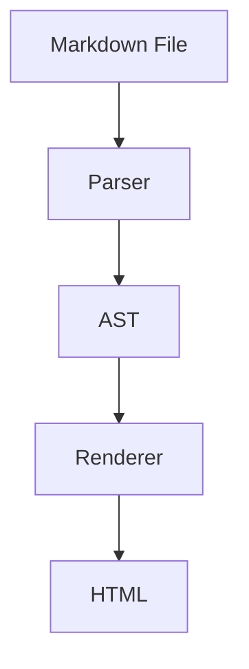

# Introduction

This is a demonstration of the **Speculator** parsing system.

It covers various markdown features.

## Text Formatting

We support _emphasis_, **strong text**, `inline code`, and [links](https://example.com).

You can also use images: 

---

## Lists

### Unordered

- Item 1
- Item 2
  - Nested Item 2.1
  - Nested Item 2.2
- Item 3

### Ordered

1. First
2. Second
3. Third

### Task List

- [x] Completed task
- [ ] Pending task
- [ ] Another task

---

## Tables

| Feature     | Status | Notes                      |
| ----------- | ------ | -------------------------- |
| Headings    | ✅     | h1-h6 supported            |
| Paragraphs  | ✅     | Basic blocks               |
| Lists       | ✅     | Ordered, unordered, nested |
| Tables      | ✅     | GFM tables                 |
| Code        | ✅     | Fenced blocks              |
| Blockquotes | ✅     | Nested support             |

---

## Code Blocks

Inline code: `const x = 42;`

reference to [§#text-formatting|Text Formating]

Fenced code block:

```typescript
function hello(): void {
  console.log("Hello World");
}
```

```json
{
  "name": "speculator",
  "version": "0.1.0"
}
```

---

## Diagrams

Mermaid diagrams are rendered automatically:



LikeC4 diagrams are rendered automatically:

<likec4-view view-id="oidc" dynamic-variant="sequence" src="./diagrams/model.c4"/>

---

## Blockquotes

> This is a blockquote.
> It can span multiple lines.

Nested blockquotes:

> First level quote
>
> > Nested quote
> >
> > > Deeply nested

---

## Horizontal Rules

Above is a horizontal rule (thematic break).

---

## Includes

:::include ./included.md :::

---

## Definitions

This spec defines {{Term}} as a concept. One can refer to [[Term]].

---

## Requirements

The implementation MUST support this requirement.

The implementation SHOULD follow best practices.

---

## Issues

This is an open issue: {{?issue-id Open Issue regarding semantics}}.
