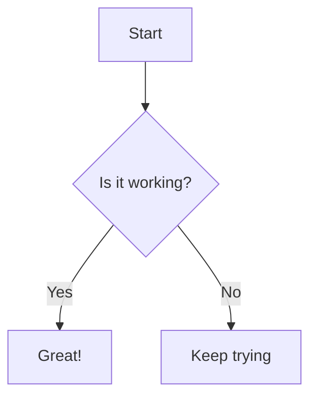

Speculator supports [Mermaid](https://mermaid.js.org/) diagrams natively within Markdown code blocks.

## AST Implementation

Mermaid diagrams are represented as standard `codeBlock` AST nodes (`type: 'codeBlock'`) with the `lang` property set to `'mermaid'`.

During the rendering phase, the `BlockRenderer` detects this specific language and uses a specialized component (e.g., `<Mermaid />`) with a `client:only` directive to render the diagram client-side.

## Usage

To include a Mermaid diagram, use a code block with the `mermaid` language identifier.

````markdown

````

## Example


The diagram will be automatically rendered as an SVG in your specification.
