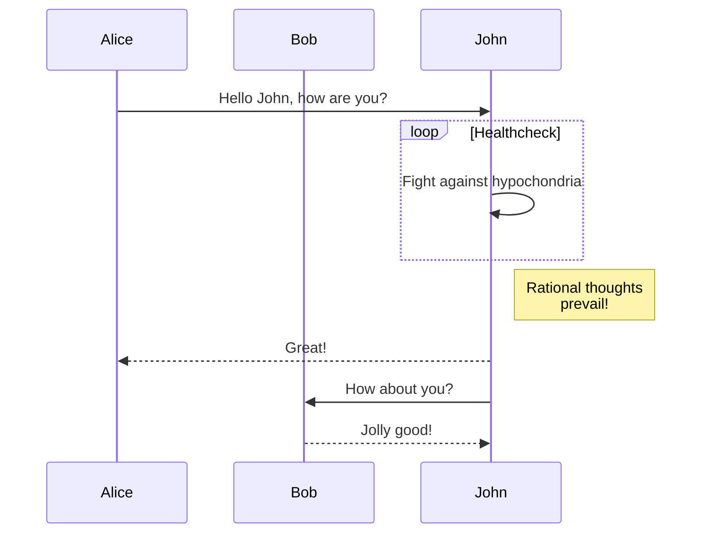

The Solospec static renderer automatically injects lightweight client-side runtimes to power diagrams like **Mermaid** and **LikeC4** when they are detected in the document.

## Mermaid Diagrams

You can author Mermaid diagrams naturally utilizing standard gated code blocks. The Solospec runtime will identify these blocks and asynchronously render them.

````markdown

````

you can also use include semantics to include mermaid diagrams from other files:

```markdown
:::include ./diagrams/sequence.mmd:::
```

### Theming

Solospec seamlessly manages the Mermaid and LikeC4 initialization configuration to make sure it respects the current runtime mode (e.g., inheriting `dark` mode seamlessly during theme-toggling in the Bikeshed theme).
