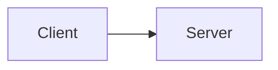

# Single Spec Page Example

This app demonstrates static page generation with `@openuji/spec-page`.

## Scope

A <dfn>Node</dfn> is an actor in the system.

The [=Node=] MUST be addressable.

<likec4-view view-id="example-flow"></likec4-view>
