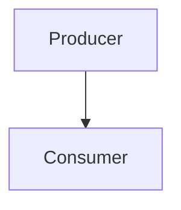

# Example Spec

<aside class="note">
This note should render inside a callout.
</aside>

<aside class="warning">
This warning should render inside a warning callout.
</aside>

<aside class="issue">
This issue should render inside an issue callout.
</aside>

## Terminology

A <dfn>Widget</dfn> is a thing in this protocol.

The [=Widget=] MUST expose an identifier and a source URL.

This spec depends on [[!RFC2119]] and [[URL-STANDARD]].

## Processing Model

See [[#terminology]] for definitions.

The client <em>MUST</em> validate Widget payloads before processing.

1. The producer sends a Widget.
2. The consumer validates that Widget state.
3. The consumer stores an immutable record.

> This paragraph is intentionally placed in a blockquote to mirror migrated prose from Bikeshed/ReSpec sources.

<likec4-view view-id="interop-flow" dynamic-variant="sequence"></likec4-view>
